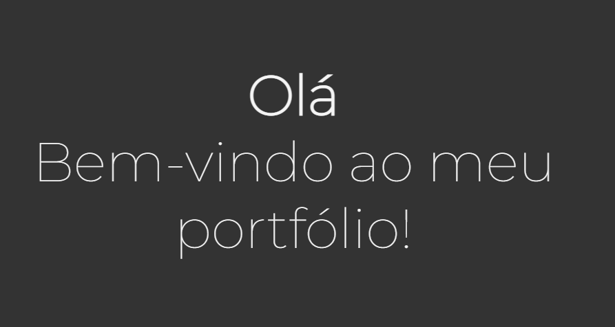

# Lucas Bomfim Portfolio

Este projeto foi feito no curso Responsive Web Design do freeCodeCamp e consiste em uma galeria de fotos usando Typography com css e html. 

## Como usar

Basta acessar o link https://lucasbomfim10.github.io/Portfolio/ para visualizar o site. Na barra de navegação, é possível acessar as diferentes seções do site.

## Screenshot

## Funcionalidades
O site conta com três seções principais:

### Home
Esta seção contém uma breve apresentação do autor.

### Projetos
Aqui o autor apresenta alguns dos projetos que desenvolveu. Cada projeto é representado por uma imagem que funciona como um link para a respectiva página do projeto no GitHub.

### Contato
Nesta seção, o autor disponibiliza algumas formas de contato.

## Autor

- Nome: Lucas Bomfim Fernandes
- Email: lucadez01@gmail.com
- LinkedIn: https://www.linkedin.com/in/lucasbomfim10/
